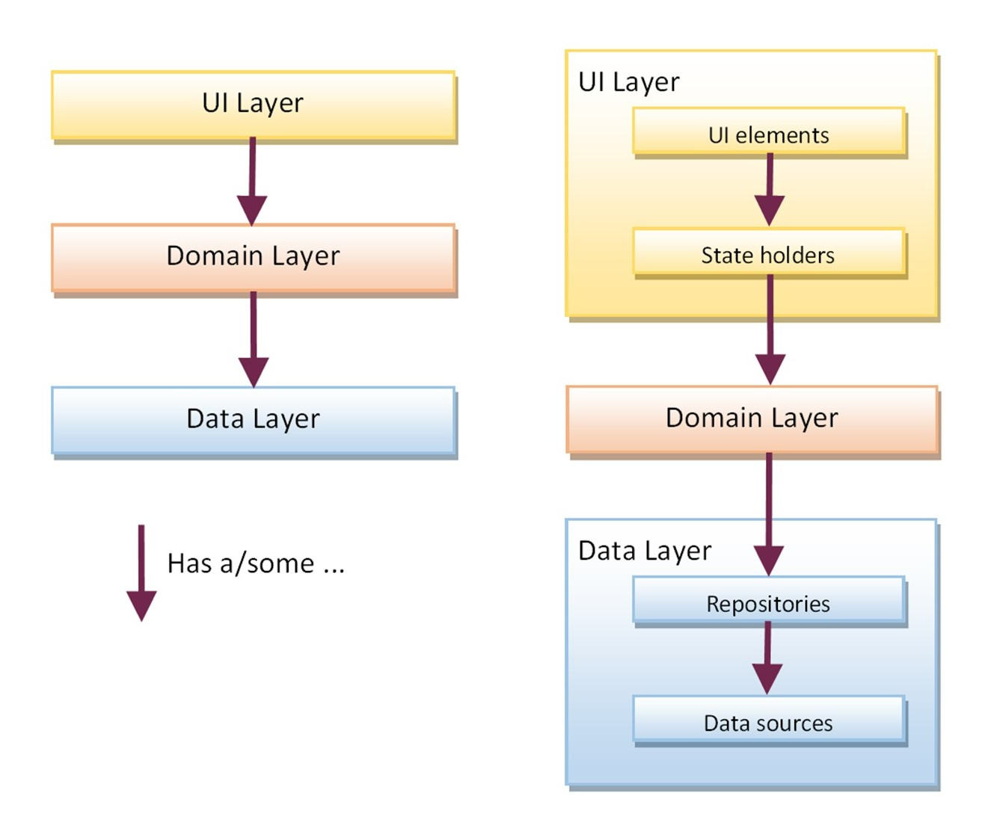

# Twitter Cleo App

### Readme format

The format used to build this readme is  [GitHub Flavored Markdown Spec format](https://github.github.com/gfm/)

### Branch strategy: [Feature flow](https://www.atlassian.com/git/tutorials/comparing-workflows/feature-branch-workflow)
 - Main branch: main
 - Feature branch: feature/XXX-XXX-XXX-name-ticket

## Project states
Stage 1: Design review. Analysis backlog design.  
Stage 2: API Analysis.  
Stage 3: Architecture and planification.  
Stage 4: Product backloag create.  
Stage 5: Development.  

## Working Agreements 

#### Coexistence rules 

 - All communications which are of interest to the whole team should be done through the Teams channel: Mobile Training - Mate & Coffee talk.  
 - Do not mention the whole team in Teams. 
 - Schedule meetings at least one day in advance. 
 - Turn on the camera as much as possible in all meetings. 
 - In case of not being able to attend the meetings, pass a summary to the group via chat. 
 - Always record the meetings so that the members who cannot attend can consult them. 
 - When scheduling a meeting always add a summary of topics to be discussed so that all members can prepare the necessary material before the meeting. 
 - Consult the availability of those involved when scheduling a meeting. 
 - Notify as soon as possible in case of meeting cancellations 
 - As the World Cup is coming up, check match schedules when scheduling a meeting. 
 - Try not to miss the main ceremonies. 
 - Bring all US (User Story) refined and with subtask loaded before planning. 

#### Methodology: ***Scrum***

 - Roles (Scrum Master, Product Owner, Development Team) 
 - Two-week sprint 
 - Ceremonies: Standup meeting (15 min max), Planning meeting (30 min), Demo meeting (30 min), Retro meeting (30 min) 
 - Jira tool will be used 
 - Type of issues: 
 - Points -> 1 2 3 5 8 13 13 21 .... from 8 onwards should be split. 
 - Backlog, In Progress, Review, Done

  | Card type    | Description                                                      |
  | :----------- | :--------------------------------------------------------------- |
  | Epics        | We will use them to define stages.                               |
  | User Stories | To define a tangible increment of the product that brings value. |
  | Tasks        | To define tasks that do not necessarily bring value to the end user in the application but are required to be performed. |
  | Subtasks     | Will reflect the subtasks that need to be performed to carry out a US or Task.  |
  | Bugs         | They will represent some punctual error of the app.              |
 
 
 ### Story Point (SP)
 
|  SP  | Tasks                                                       |
| :--: | :---------------------------------------------------------- |
| 1    | Make a simple graphical change, service mapping change      |
| 2    | Implementation of consultative component                    |
| 3    | Implement a use case with tests, build a transactional view |
| 5    | Implement data source along with its tests                  |
| 8    | Implement repository logic with persistence and service query. Implement consultative view with View Model integration. |

## Technical Agreements 

 - Code Review: review by at least one technical lead is required (Review the code and do a minimal test at your site that compiles and tests the functionality, run tests if they exist). 

### Definition of Ready 

 - It must be correctly defined with a statement containing the final value it would add to the product for the user, 
 - It must contain all the details, such as texts, design, resources, and API (Application - Programming Interfaces) definitions 
 - It must have the AC (Acceptance Criteria) well defined and clear. 
 - It must have well defined, by the dev team, all the subtasks needed to accomplish the details and estimations. 

### Definition of Done 

 - It must accomplish all the AC defined in the ticket. 
 - The code must be merged into the main branch. 
 - All the tests must be completed with an OK. 
 - It must not exist style errors (Static analysis of code) 
 - It must pass the Code Review from Technical Lead  
 - It must be seen by the PO (Product Owner) 
 
 
 
## Architecture

### Basics concepts

A model-view-viewmodel (MVVM) architectural pattern is used and is built arround [Android Architecture Components](https://developer.android.com/topic/libraries/architecture/) and follows the recommendations laid out in the [Guide to App Architecture](https://developer.android.com/jetpack/docs/guide).

Logic is kept away from Activity and Fragment. Data is observed using [Kotlin Flow](https://developer.android.com/kotlin/flow/stateflow-and-sharedflow) based on StateFlow.

* User Interface built with [Jetpack Compose](https://developer.android.com/jetpack/compose)
* The app is a single-activity architecture using [Navigation Compose](https://developer.android.com/jetpack/compose/navigation)
* Reactive UIs using Flow and [Coroutines](https://developer.android.com/kotlin/coroutines) for asynchronous operations.

### Layer diagram

### Kotlin

The app is entirely in Kotlin and uses [Jetpack's Android Ktx extensions](https://developer.android.com/kotlin/ktx).

Asynchronous task are handled with [coroutines](https://developer.android.com/kotlin/coroutines).

### Directory structure
    /app
        /src
            /main
                /java
                    /ar.scacchipa.twittercloneapp
                        /di
                        /component
                        /domain
                        /ui
                        /repository
                        /datasource
                /res
        /androidTest
            /ui
        /test
            /di
            /component
            /domain
            /repository
            /datasource

* For default, /androidTest/ui/ was adding, but this will not be implemented.